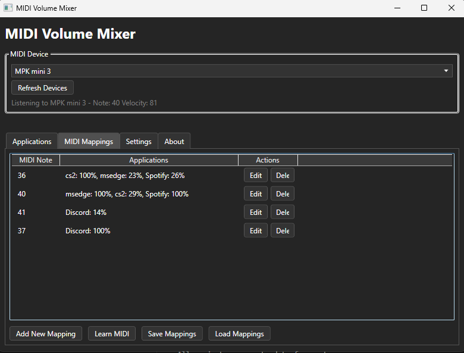

# MIDI Volume Mixer

> Warning: First attempt at vibe-coding an app as an experiment. I mainly wanted the functionality for my personal use and copilot agent was 100% the quickest way to get it done.



A Windows application that allows you to control application volumes using a MIDI controller.

## Download

You can download the latest version of MIDI Volume Mixer from the [Releases](https://github.com/YOUR-USERNAME/midi-volume-mixer/releases) page.

The download is a single self-contained executable with all dependencies included - no installation required.

## Features

- Connect to any MIDI input device
- Control the volume of individual Windows applications
- Create custom mappings between MIDI notes and application volume levels
- Save and load your mappings for later use
- Set multiple applications to different volumes with a single MIDI pad press

## Requirements

- Windows 10 or later
- .NET 5.0 or later
- A MIDI controller (keyboard, pad controller, etc.)

## How to Use

1. Connect your MIDI device to your computer
2. Launch the MIDI Volume Mixer application
3. Select your MIDI device from the dropdown menu
4. View running applications in the "Applications" tab
5. Create mappings in the "MIDI Mappings" tab
   - Click "Learn MIDI" and press a pad/key on your MIDI controller
   - Select which applications to control and their volume levels
   - Save your mapping
6. Press the mapped MIDI keys to instantly adjust application volumes

## Example Scenarios

- **Gaming**: Map one pad to set your game to 100% volume and Discord to 50%
- **Video Editing**: Map pads for different audio levels between your editing software and preview
- **Music Production**: Control volumes of different audio applications while recording

## Default Mappings

- MIDI Note 36 (C1): Set CS2.exe to 20% and Microsoft Edge to 100%
- MIDI Note 37 (C#1): Set both CS2.exe and Microsoft Edge to 100%

## Building from Source

1. Clone this repository
2. Open the solution in Visual Studio 2019 or later
3. Restore NuGet packages
4. Build the solution

## Creating Releases

This project uses GitHub Actions to automatically build and publish releases:

1. Update version information in the code if needed
2. Create and push a new tag with the version number:
   ```
   git tag v1.0.0
   git push origin v1.0.0
   ```
3. GitHub Actions will automatically build the application and create a new release with a standalone executable

## Technologies Used

- C# and WPF for the user interface
- NAudio for audio control
- Melanchall.DryWetMidi for MIDI input handling
- Windows Core Audio API for application volume control
